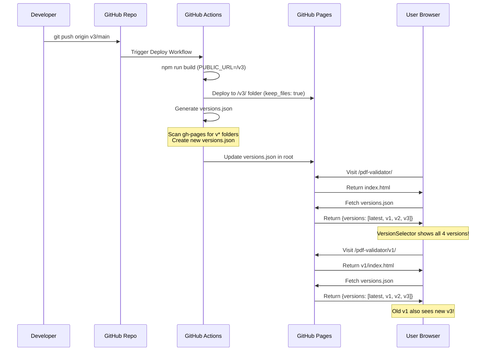

# Автоматичне оновлення списку версій - Схема

## Концепція: Централізований versions.json

```
┌─────────────────────────────────────────────────────────────┐
│           GitHub Pages (gh-pages branch)                    │
├─────────────────────────────────────────────────────────────┤
│                                                             │
│  📄 versions.json  ← ЄДИНЕ ДЖЕРЕЛО ПРАВДИ                  │
│  ├── latest (master)                                        │
│  ├── v1                                                     │
│  ├── v2                                                     │
│  └── v3                                                     │
│                                                             │
│  📁 / (root - master)          →  fetch versions.json      │
│  📁 /v1/                       →  fetch versions.json      │
│  📁 /v2/                       →  fetch versions.json      │
│  📁 /v3/                       →  fetch versions.json      │
│                                                             │
└─────────────────────────────────────────────────────────────┘
```

## Переваги цього підходу

### ✅ Автоматична синхронізація

```
Було (статичний список):
┌─────────────┐
│   v1 page   │  hardcoded: [latest, v1]
│   v2 page   │  hardcoded: [latest, v1, v2]
│ latest page │  hardcoded: [latest, v1, v2]
└─────────────┘
❌ При додаванні v3 треба rebuild всі версії!

Стало (динамічний список):
┌─────────────┐
│   v1 page   │ ─┐
│   v2 page   │ ─┼──→ fetch versions.json → [latest, v1, v2, v3]
│   v3 page   │ ─┤
│ latest page │ ─┘
└─────────────┘
✅ При додаванні v3 оновлюється тільки versions.json!
```

## Workflow створення нової версії



## Структура файлів на gh-pages

```
gh-pages/
├── versions.json                    ← Єдине джерело списку версій
│   {
│     "versions": [
│       {
│         "id": "latest",
│         "label": "Поточна версія",
│         "path": "/pdf-validator/",
│         ...
│       },
│       {
│         "id": "v3",
│         "label": "Версія 3",
│         "path": "/pdf-validator/v3/",
│         ...
│       }
│     ]
│   }
│
├── index.html                       ← Master version
├── static/
│   ├── js/
│   └── css/
│
├── v1/
│   ├── index.html                   ← Version 1
│   └── static/
│
├── v2/
│   ├── index.html                   ← Version 2
│   └── static/
│
└── v3/
    ├── index.html                   ← Version 3 (NEW!)
    └── static/
```

## Алгоритм оновлення versions.json

### Варіант 1: Автоматичне сканування (GitHub Actions)

```yaml
# .github/workflows/update-versions.yml
steps:
  - name: Scan for version folders
    run: |
      # Checkout gh-pages
      git checkout gh-pages

      # Find all v* folders
      VERSIONS=$(find . -maxdepth 1 -type d -name 'v[0-9]*' | sed 's|./||')

      # Generate versions.json
      echo '{"versions": [' > versions.json
      echo '  {"id": "latest", "label": "Поточна версія", ...}' >> versions.json

      for v in $VERSIONS; do
        echo '  ,{"id": "'$v'", "label": "Версія '${v#v}'", ...}' >> versions.json
      done

      echo ']}' >> versions.json

      # Commit
      git add versions.json
      git commit -m "Auto-update versions.json"
      git push
```

### Варіант 2: Ручна конфігурація (scripts/generate-versions.js)

```javascript
// scripts/generate-versions.js
const VERSIONS_CONFIG = [
  { id: 'latest', label: 'Поточна версія', ... },
  { id: 'v1', label: 'Версія 1', ... },
  { id: 'v2', label: 'Versія 2', ... },
  { id: 'v3', label: 'Версія 3', ... },  // ← Додати вручну
];

// Генерує public/versions.json
// Копіюється в build/ при npm run build
// Розгортається на gh-pages при deploy
```

**Рекомендація**: Варіант 2 (ручний) - більш контрольований та передбачуваний.

## Fallback стратегія

```typescript
// VersionSelector fallback logic
const fetchVersions = async () => {
  try {
    const response = await fetch('/pdf-validator/versions.json')
    const data = await response.json()
    setVersions(data.versions)
  } catch (error) {
    console.error('Failed to fetch versions.json, using fallback')

    // Fallback: мінімальний список
    setVersions([
      {
        id: 'latest',
        label: 'Поточна версія',
        path: '/pdf-validator/',
        isLatest: true,
        status: 'stable',
      },
    ])
  }
}
```

## Тестування автоматичного оновлення

### Сценарій 1: Додати нову версію v3

```bash
# 1. Створити гілку
git checkout -b v3/main master

# 2. Оновити scripts/generate-versions.js
# Додати v3 в VERSIONS_CONFIG

# 3. Commit і push
git add scripts/generate-versions.js
git commit -m "Add v3 to versions config"
git push origin v3/main

# 4. GitHub Actions автоматично:
#    - Build v3
#    - Deploy в /v3/
#    - Generate і commit versions.json
#    - Всі версії тепер бачать v3!

# 5. Перевірити
curl https://victorchei.github.io/pdf-validator/versions.json
# Повинно містити v3
```

### Сценарій 2: Перевірити що старі версії бачать нові

```bash
# 1. Відкрити v1 в браузері
open https://victorchei.github.io/pdf-validator/v1/

# 2. Відкрити DevTools Console

# 3. Перевірити що VersionSelector завантажив versions.json
# Повинно бути console.log: "✅ Versions loaded: 4"
# [latest, v1, v2, v3]

# 4. Перевірити dropdown
# Має показувати всі 4 версії включно з v3
```

## Переваги vs Недоліки

### ✅ Переваги централізованого versions.json

1. **Автоматична синхронізація** - додаєш нову версію → всі версії бачать її
2. **Не треба rebuild** старих версій
3. **Single source of truth** - один файл керує всім
4. **Легко оновлювати** - змінити один JSON файл
5. **Масштабованість** - працює з будь-якою кількістю версій

### ⚠️ Недоліки та обмеження

1. **Додатковий HTTP запит** - кожна сторінка робить fetch
2. **CORS потенційні проблеми** - якщо gh-pages налаштований неправильно
3. **Fallback необхідний** - якщо versions.json не завантажився
4. **Ручне оновлення** скрипта при додаванні версії (у варіанті 2)

### Оптимізація

```typescript
// Cache versions.json in localStorage
const CACHE_KEY = 'pdf-validator-versions'
const CACHE_TTL = 1000 * 60 * 60 // 1 година

const fetchVersions = async () => {
  // Спробувати з кешу
  const cached = localStorage.getItem(CACHE_KEY)
  if (cached) {
    const { data, timestamp } = JSON.parse(cached)
    if (Date.now() - timestamp < CACHE_TTL) {
      setVersions(data.versions)
      return
    }
  }

  // Fetch з мережі
  const response = await fetch('/pdf-validator/versions.json')
  const data = await response.json()

  // Зберегти в кеш
  localStorage.setItem(
    CACHE_KEY,
    JSON.stringify({
      data,
      timestamp: Date.now(),
    })
  )

  setVersions(data.versions)
}
```

## Підсумок

**Ключова ідея**: Всі версії фетчують один файл `versions.json` з кореня gh-pages, що дозволяє автоматично синхронізувати список версій без rebuild старих версій.

**Мінімальна реалізація**:

1. Створити `scripts/generate-versions.js`
2. Додати в `prebuild`: `npm run generate-versions`
3. Deploy копіює `public/versions.json` → `build/versions.json` → gh-pages root
4. VersionSelector фетчує versions.json при завантаженні
5. При додаванні нової версії - оновити скрипт і deploy

**Результат**: Одне оновлення → всі версії синхронізовані! 🎉
