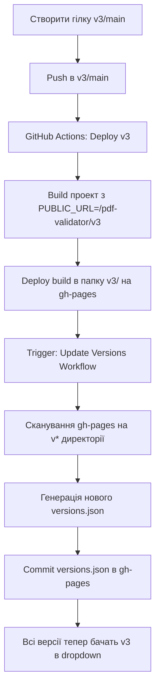

# Мультиверсійна архітектура розгортання

## Огляд

Проект потребує системи розгортання, яка дозволяє одночасно розміщувати декілька версій на одному домені з використанням версійних шляхів:

- **Основна (master)**: `https://victorchei.github.io/pdf-validator/`
- **Версія v1**: `https://victorchei.github.io/pdf-validator/v1/`
- **Версія v2**: `https://victorchei.github.io/pdf-validator/v2/`
- **Версія vN**: `https://victorchei.github.io/pdf-validator/vN/`

## Додаткова документація

📚 **Детальна схема автоматичного оновлення версій**: [AUTO_VERSIONS_UPDATE.md](AUTO_VERSIONS_UPDATE.md)

Цей документ містить:

- Візуальні діаграми автоматичної синхронізації
- Детальні приклади workflow
- Стратегії кешування та оптимізації
- Тестові сценарії

---

## Архітектура розв'язку

### 1. Структура Git веток

```
master (main branch)
├── HEAD → Поточна версія, розгортається в /pdf-validator/
├── Теги: stable, latest

v1/* (version branches)
├── v1/main → Розгортається в /pdf-validator/v1/
├── Теги: v1.0.0, v1.1.0, v1.2.0

v2/* (version branches)
├── v2/main → Розгортається в /pdf-validator/v2/
├── Теги: v2.0.0, v2.1.0

develop (development branch)
└── Базис для нових фіч
```

### 2. Версійна нумерація

- **master**: Поточна версія без префіксу (за замовчуванням)
- **v1/main**: Версія 1 (legacy, бага-фікси)
- **v2/main**: Версія 2 (active development)
- **v3/main**: Версія 3 (future)

---

## Компонента UI: Селект версій

### Розміщення

Селект буде розміщений **після заголовку** (TopInfo компонента) та дозволяє користувачам перемикатися між доступними версіями.

```tsx
// src/components/VersionSelector/index.tsx
<Select value={currentVersion} onChange={handleVersionChange} label="Версія">
  <MenuItem value="latest">Поточна версія (master)</MenuItem>
  <MenuItem value="v1">Версія 1 (Legacy)</MenuItem>
  <MenuItem value="v2">Версія 2 (Stable)</MenuItem>
  <MenuItem value="v3">Версія 3 (Beta)</MenuItem>
</Select>
```

### Логіка переходу

```typescript
const handleVersionChange = (version: string) => {
  const baseUrl = 'https://victorchei.github.io/pdf-validator'

  if (version === 'latest') {
    window.location.href = baseUrl
  } else {
    window.location.href = `${baseUrl}/${version}/`
  }
}
```

---

## GitHub Pages конфігурація

### 1. Налаштування репозиторію

**Settings → Pages:**

- Source: Deploy from a branch
- Branch: gh-pages
- Folder: / (root)
- Custom domain: `victorchei.github.io` (якщо потрібно)

### 2. CNAME файл (якщо користуєтесь custom domain)

```
victorchei.github.io
```

### 3. Структура Build Artifacts

```
gh-pages branch
├── index.html (master)
├── v1/
│   ├── index.html
│   └── static/
├── v2/
│   ├── index.html
│   └── static/
└── v3/
    ├── index.html
    └── static/
```

---

## React Routing конфігурація

### 1. package.json - версійні homepage

**Для master:**

```json
{
  "homepage": "https://victorchei.github.io/pdf-validator/"
}
```

**Для v1:**

```json
{
  "homepage": "https://victorchei.github.io/pdf-validator/v1/"
}
```

**Для v2:**

```json
{
  "homepage": "https://victorchei.github.io/pdf-validator/v2/"
}
```

### 2. React Router конфігурація

```tsx
// src/index.tsx
;<BrowserRouter basename={getBasename()}>
  <ThemeProvider theme={theme}>
    <CssBaseline />
    <App />
  </ThemeProvider>
</BrowserRouter>

function getBasename(): string {
  const path = window.location.pathname

  if (path.includes('/v1')) return '/pdf-validator/v1'
  if (path.includes('/v2')) return '/pdf-validator/v2'
  if (path.includes('/v3')) return '/pdf-validator/v3'

  return '/pdf-validator'
}
```

---

## CI/CD Pipeline (GitHub Actions)

### 1. Deploy Master

**`.github/workflows/deploy-master.yml`**

```yaml
name: Deploy Master

on:
  push:
    branches: [master]

jobs:
  build-and-deploy:
    runs-on: ubuntu-latest
    steps:
      - uses: actions/checkout@v3

      - name: Setup Node
        uses: actions/setup-node@v3
        with:
          node-version: '18'

      - name: Install dependencies
        run: npm ci

      - name: Build
        run: npm run build
        env:
          PUBLIC_URL: 'https://victorchei.github.io/pdf-validator'

      - name: Deploy to gh-pages
        uses: peaceiris/actions-gh-pages@v3
        with:
          github_token: ${{ secrets.GITHUB_TOKEN }}
          publish_dir: ./build
          destination_dir: ./
```

### 2. Deploy Versioned (v1, v2, v3...)

**`.github/workflows/deploy-version.yml`**

```yaml
name: Deploy Version Branch

on:
  push:
    branches:
      - 'v[0-9]+/main'

jobs:
  build-and-deploy:
    runs-on: ubuntu-latest
    steps:
      - uses: actions/checkout@v3

      - name: Extract version
        id: version
        run: |
          VERSION=$(echo $GITHUB_REF | sed 's/refs\/heads\///' | cut -d'/' -f1)
          echo "version=$VERSION" >> $GITHUB_OUTPUT

      - name: Setup Node
        uses: actions/setup-node@v3
        with:
          node-version: '18'

      - name: Install dependencies
        run: npm ci

      - name: Build
        run: npm run build
        env:
          PUBLIC_URL: 'https://victorchei.github.io/pdf-validator/${{ steps.version.outputs.version }}'

      - name: Deploy to gh-pages
        uses: peaceiris/actions-gh-pages@v3
        with:
          github_token: ${{ secrets.GITHUB_TOKEN }}
          publish_dir: ./build
          destination_dir: ${{ steps.version.outputs.version }}
```

---

## Процес розробки та розгортання

### 1. Створення нової версії

```bash
# Створити нову версійну гілку
git checkout -b v2/main master

# Зробити необхідні зміни
# ...

# Закоммітити та запушити
git add .
git commit -m "v2: Initial release"
git push origin v2/main
```

### 2. GitHub Actions автоматично

1. Детектує push в `v2/main`
2. Екстрахує версію (`v2`)
3. Білдить проект з `PUBLIC_URL=/pdf-validator/v2`
4. Розгортає в папку `v2/` на gh-pages гілці

### 3. Результат

Сайт буде доступний:

- Master: `https://victorchei.github.io/pdf-validator/`
- v2: `https://victorchei.github.io/pdf-validator/v2/`

---

## Автоматичне оновлення списку версій

### Централізований versions.json

Для автоматичного оновлення списку версій на всіх сторінках, створюємо **єдиний файл `versions.json`** у корені gh-pages, який містить метадані про всі доступні версії.

**Структура `versions.json` (розміщується в корені gh-pages):**

```json
{
  "versions": [
    {
      "id": "latest",
      "label": "Поточна версія",
      "path": "/pdf-validator/",
      "branch": "master",
      "isLatest": true,
      "releaseDate": "2026-01-28",
      "status": "stable"
    },
    {
      "id": "v2",
      "label": "Версія 2",
      "path": "/pdf-validator/v2/",
      "branch": "v2/main",
      "isLatest": false,
      "releaseDate": "2026-01-15",
      "status": "stable"
    },
    {
      "id": "v1",
      "label": "Версія 1",
      "path": "/pdf-validator/v1/",
      "branch": "v1/main",
      "isLatest": false,
      "releaseDate": "2025-12-01",
      "status": "legacy"
    }
  ],
  "lastUpdated": "2026-01-28T10:30:00Z"
}
```

### GitHub Actions: Автоматичне оновлення versions.json

**`.github/workflows/update-versions.yml`** - запускається після кожного deploy:

```yaml
name: Update Versions Manifest

on:
  workflow_run:
    workflows: ['Deploy Master', 'Deploy Version Branch']
    types:
      - completed

jobs:
  update-versions:
    runs-on: ubuntu-latest
    if: ${{ github.event.workflow_run.conclusion == 'success' }}

    steps:
      - name: Checkout gh-pages
        uses: actions/checkout@v3
        with:
          ref: gh-pages

      - name: Scan for versions
        id: scan
        run: |
          # Знайти всі директорії що починаються з v + число
          VERSIONS=$(find . -maxdepth 1 -type d -name 'v[0-9]*' | sed 's|./||' | sort -V)
          echo "versions=$VERSIONS" >> $GITHUB_OUTPUT

      - name: Generate versions.json
        run: |
          cat > versions.json << 'EOF'
          {
            "versions": [
              {
                "id": "latest",
                "label": "Поточна версія",
                "path": "/pdf-validator/",
                "branch": "master",
                "isLatest": true,
                "releaseDate": "$(date -I)",
                "status": "stable"
              }
          EOF

          # Додати знайдені версії
          for version in ${{ steps.scan.outputs.versions }}; do
            cat >> versions.json << EOF
              ,{
                "id": "$version",
                "label": "Версія ${version#v}",
                "path": "/pdf-validator/$version/",
                "branch": "$version/main",
                "isLatest": false,
                "releaseDate": "$(date -I)",
                "status": "stable"
              }
          EOF
          done

          cat >> versions.json << 'EOF'
            ],
            "lastUpdated": "$(date -Iseconds)"
          }
          EOF

      - name: Commit and push
        run: |
          git config user.name "github-actions[bot]"
          git config user.email "github-actions[bot]@users.noreply.github.com"
          git add versions.json
          git diff --staged --quiet || git commit -m "Auto-update versions.json"
          git push
```

### Альтернатива: Node.js скрипт для генерації

**`scripts/generate-versions.js`** - більш контрольований підхід:

```javascript
const fs = require('fs')
const path = require('path')

const VERSIONS_CONFIG = {
  latest: {
    id: 'latest',
    label: 'Поточна версія',
    path: '/pdf-validator/',
    branch: 'master',
    isLatest: true,
    status: 'stable',
  },
  v1: {
    id: 'v1',
    label: 'Версія 1 (Legacy)',
    path: '/pdf-validator/v1/',
    branch: 'v1/main',
    isLatest: false,
    status: 'legacy',
  },
  v2: {
    id: 'v2',
    label: 'Версія 2',
    path: '/pdf-validator/v2/',
    branch: 'v2/main',
    isLatest: false,
    status: 'stable',
  },
}

function generateVersionsJson() {
  const versions = Object.values(VERSIONS_CONFIG).map((v) => ({
    ...v,
    releaseDate: new Date().toISOString().split('T')[0],
  }))

  const manifest = {
    versions,
    lastUpdated: new Date().toISOString(),
  }

  // Запис в корінь проекту (буде скопійовано при build)
  fs.writeFileSync(path.join(__dirname, '../public/versions.json'), JSON.stringify(manifest, null, 2))

  console.log('✅ versions.json успішно згенеровано')
}

generateVersionsJson()
```

**Інтеграція в package.json:**

```json
{
  "scripts": {
    "prebuild": "node scripts/generate-versions.js",
    "build": "react-scripts build"
  }
}
```

### Оновлений GitHub Actions workflow

**`.github/workflows/deploy-master.yml`** (з versions.json):

```yaml
name: Deploy Master

on:
  push:
    branches: [master]

jobs:
  build-and-deploy:
    runs-on: ubuntu-latest
    steps:
      - uses: actions/checkout@v3

      - name: Setup Node
        uses: actions/setup-node@v3
        with:
          node-version: '18'

      - name: Install dependencies
        run: npm ci

      - name: Generate versions.json
        run: node scripts/generate-versions.js

      - name: Build
        run: npm run build
        env:
          PUBLIC_URL: 'https://victorchei.github.io/pdf-validator'

      - name: Copy versions.json to build root
        run: cp public/versions.json build/versions.json

      - name: Deploy to gh-pages
        uses: peaceiris/actions-gh-pages@v3
        with:
          github_token: ${{ secrets.GITHUB_TOKEN }}
          publish_dir: ./build
          destination_dir: ./
          keep_files: true # ← Зберігає v1/, v2/ папки
```

**Важливо**: `keep_files: true` дозволяє зберігати інші версії при deploy master.

## Компонента VersionSelector детально

### src/components/VersionSelector/index.tsx

```tsx
import { FormControl, InputLabel, MenuItem, Select, SelectChangeEvent, CircularProgress } from '@mui/material'
import React, { useEffect, useState } from 'react'
import styles from './VersionSelector.module.css'

interface Version {
  id: string
  label: string
  path: string
  branch: string
  isLatest: boolean
  releaseDate: string
  status: 'stable' | 'legacy' | 'beta'
}

interface VersionsManifest {
  versions: Version[]
  lastUpdated: string
}

export const VersionSelector = () => {
  const [currentVersion, setCurrentVersion] = useState<string>('latest')
  const [versions, setVersions] = useState<Version[]>([])
  const [loading, setLoading] = useState<boolean>(true)
  const [error, setError] = useState<string | null>(null)

  useEffect(() => {
    // 1. Детектити поточну версію з pathname
    const pathname = window.location.pathname
    const detectedVersion = detectCurrentVersion(pathname)
    setCurrentVersion(detectedVersion)

    // 2. Завантажити доступні версії з versions.json
    fetchVersions()
  }, [])

  const detectCurrentVersion = (pathname: string): string => {
    // Шукаємо паттерн /pdf-validator/vN/
    const match = pathname.match(/\/pdf-validator\/(v\d+)/)
    if (match) {
      return match[1] // повертає "v1", "v2", тощо
    }
    return 'latest'
  }

  const fetchVersions = async () => {
    try {
      setLoading(true)

      // Завантажити versions.json з кореня gh-pages
      const response = await fetch('https://victorchei.github.io/pdf-validator/versions.json')

      if (!response.ok) {
        throw new Error('Failed to fetch versions')
      }

      const data: VersionsManifest = await response.json()
      setVersions(data.versions)
      setError(null)
    } catch (err) {
      console.error('Error fetching versions:', err)
      setError('Не вдалося завантажити список версій')

      // Fallback до жорстко закодованого списку
      setVersions([
        {
          id: 'latest',
          label: 'Поточна версія',
          path: '/pdf-validator/',
          branch: 'master',
          isLatest: true,
          releaseDate: new Date().toISOString().split('T')[0],
          status: 'stable',
        },
      ])
    } finally {
      setLoading(false)
    }
  }

  const handleVersionChange = (event: SelectChangeEvent<string>) => {
    const versionId = event.target.value
    const selectedVersion = versions.find((v) => v.id === versionId)

    if (selectedVersion) {
      // Перенаправити на версію
      window.location.href = `https://victorchei.github.io${selectedVersion.path}`
    }
  }

  if (loading) {
    return (
      <div className={styles.loadingContainer}>
        <CircularProgress size={20} />
      </div>
    )
  }

  return (
    <FormControl sx={{ minWidth: 200 }} size="small" error={!!error}>
      <InputLabel>Версія</InputLabel>
      <Select value={currentVersion} onChange={handleVersionChange} label="Версія" className={styles.selector}>
        {versions.map((version) => (
          <MenuItem key={version.id} value={version.id}>
            {version.label}
            {version.status === 'legacy' && ' (Legacy)'}
            {version.status === 'beta' && ' (Beta)'}
          </MenuItem>
        ))}
      </Select>
    </FormControl>
  )
}
```

### src/components/VersionSelector/VersionSelector.module.css

```css
.selector {
  background-color: var(--color-white);
  border-color: var(--color-primary-blue);
}

.selector:hover {
  border-color: var(--color-dark-blue);
}

@media (max-width: 600px) {
  .selector {
    min-width: 150px;
    font-size: 0.8rem;
  }
}
```

### Інтеграція з TopInfo

```tsx
// src/components/TopInfo/index.tsx
import { VersionSelector } from '../VersionSelector'

export const TopInfo = () => {
  return (
    <div className={styles.container}>
      <Typography className={styles.title}>Валідатор дипломних робіт</Typography>
      <Typography className={styles.description}>Перевірка дипломної роботи на відповідність стандартам</Typography>

      {/* Нова строка для селектора версій */}
      <div className={styles.versionSelectorWrapper}>
        <VersionSelector />
      </div>

      <Typography className={styles.instruction}>Завантажте файл PDF для перевірки</Typography>
    </div>
  )
}
```

---

## Базові гітхаб налаштування для веток

### 1. Захист веток

**Settings → Branches:**

```
Branch protection rules:

master:
  ✅ Require pull request reviews
  ✅ Require status checks to pass
  ✅ Include administrators

v1/main:
  ✅ Require pull request reviews
  ✅ Require status checks to pass

v2/main:
  ✅ Require pull request reviews
  ✅ Require status checks to pass
```

### 2. Правила для версійних веток

```bash
# Приклад: Допущені вельбре від версійної гілки
v1/* → можна робити PR в master? НІ
v1/* → можна робити PR в develop? ДА (для портування фіч)
master → можна робити PR в v1/* ? НІ (v1 - стабільна)
develop → можна робити PR в v2/main? ДА
```

---

## Стратегія розгортання версій

### Стан 1: Тільки Master

```
master → Build & Deploy
  ↓
https://victorchei.github.io/pdf-validator/
```

### Стан 2: Master + v1 Legacy Support

```
master → Build & Deploy → https://victorchei.github.io/pdf-validator/
v1/main → Build & Deploy → https://victorchei.github.io/pdf-validator/v1/

(v1 отримує тільки критичні бага-фікси)
```

### Стан 3: Master + v1 + v2

```
develop → PR Reviewd by team
  ↓
v2/main → Build & Deploy → https://victorchei.github.io/pdf-validator/v2/
  ↓
master → Build & Deploy → https://victorchei.github.io/pdf-validator/

v1/main → Build & Deploy → https://victorchei.github.io/pdf-validator/v1/
(тільки критичні фікси)
```

---

## Контрольний список реалізації

### Фаза 1: Базова налаштування

- [ ] Створити GitHub Actions workflows
- [ ] Налаштувати gh-pages branch
- [ ] Додати PUBLIC_URL в package.json
- [ ] Протестувати master deployment

### Фаза 2: Версійна архітектура

- [ ] Створити v1/main гілку
- [ ] Оновити React Router для basename
- [ ] Додати VersionSelector компонент
- [ ] Протестувати v1 routing

### Фаза 3: Розширення версій

- [ ] Створити v2/main гілку
- [ ] Додати v2 до VersionSelector
- [ ] Протестувати переходи між версіями
- [ ] Документувати процес для команди

### Фаза 4: CI/CD оптимізація

- [ ] Додати branch protection rules
- [ ] Настроїти auto-deployment на pushes
- [ ] Налаштувати notifications
- [ ] Додати version badges до README

---

## Приклад вивід URL структури

```
https://victorchei.github.io/
├── pdf-validator/                    ← Master version
│   ├── index.html
│   ├── static/
│   ├── favicon.ico
│   └── 404.html (для SPA routing)
│
├── pdf-validator/v1/                 ← Version 1
│   ├── index.html
│   ├── static/
│   └── favicon.ico
│
├── pdf-validator/v2/                 ← Version 2
│   ├── index.html
│   ├── static/
│   └── favicon.ico
│
└── pdf-validator/v3/                 ← Version 3
    ├── index.html
    ├── static/
    └── favicon.ico
```

---

## Напорядження через версіями

### Для користувача

1. Відкриває <https://victorchei.github.io/pdf-validator/>
2. Бачить VersionSelector селект
3. Вибирає "Версія 2 (Stable)" з dropdown
4. Редірект на <https://victorchei.github.io/pdf-validator/v2/>
5. Користується v2 версією

### Для розробника

1. Робить фіч на develop
2. Робить PR в v2/main
3. Merge в v2/main
4. GitHub Actions запускається
5. Білд виконується з PUBLIC_URL=/pdf-validator/v2
6. Артефакти завантажуються в папку v2/ на gh-pages
7. Версія доступна на <https://victorchei.github.io/pdf-validator/v2/>

---

## 404 редірект для SPA

Для коректної роботи React Router SPA, додати `_redirects` або `404.html` для кожної версії:

**public/404.html** (одинаковий для всіх версій):

```html
<!DOCTYPE html>
<html>
  <head>
    <meta charset="utf-8" />
    <title>Single Page App</title>
    <script type="text/javascript">
      const redirect = sessionStorage.redirect
      delete sessionStorage.redirect
      if (redirect && redirect !== location.href) {
        history.replaceState(null, null, redirect)
      }
    </script>
  </head>
  <body></body>
</html>
```

---

## Посилання на ресурси

- [GitHub Pages Docs](https://docs.github.com/en/pages)
- [GitHub Actions Docs](https://docs.github.com/en/actions)
- [React Router Basename](https://reactrouter.com/en/main/start/overview#configuration)
- [Create React App Deployment](https://create-react-app.dev/docs/deployment/)

---

## Детальна схема оновлення versions.json

### Workflow при додаванні нової версії



### Стратегія збереження файлів між deploy

**Проблема**: При deploy master може перезаписати всю gh-pages гілку, видаливши v1/, v2/ папки.

**Рішення**: Використовувати `keep_files: true` в peaceiris/actions-gh-pages:

```yaml
- name: Deploy to gh-pages
  uses: peaceiris/actions-gh-pages@v3
  with:
    github_token: ${{ secrets.GITHUB_TOKEN }}
    publish_dir: ./build
    destination_dir: ./ # або конкретна папка
    keep_files: true # ← НЕ видаляє інші файли в gh-pages
```

**Альтернатива**: Розділити deployments за папками:

```yaml
# Master deploy
destination_dir: ./              # Корінь
keep_files: true

# v1 deploy
destination_dir: ./v1            # Тільки v1/
keep_files: true

# v2 deploy
destination_dir: ./v2            # Тільки v2/
keep_files: true
```

### Синхронізація versions.json між усіма deployment

**Підхід 1: Централізований файл (Рекомендовано)**

1. `versions.json` зберігається **тільки в корені** gh-pages
2. Всі версії фетчують його з `https://victorchei.github.io/pdf-validator/versions.json`
3. При кожному deploy будь-якої версії - оновлюється єдиний файл

**Переваги**:

- ✅ Single source of truth
- ✅ Автоматична синхронізація між усіма версіями
- ✅ Не потрібно rebuild старих версій

**Підхід 2: Копіювання в кожну версію (Fallback)**

```yaml
- name: Copy versions.json to all version folders
  run: |
    cp public/versions.json build/versions.json

    # Після deploy, скопіювати в інші версії
    git checkout gh-pages
    cp versions.json v1/versions.json
    cp versions.json v2/versions.json
    git add v*/versions.json
    git commit -m "Sync versions.json to all deployments"
    git push
```

**Недоліки**:

- ❌ Складніше підтримувати
- ❌ Більше файлів для sync

---

## Практичний приклад: Повний deploy pipeline

### Крок 1: Налаштування репозиторію

```bash
# Структура веток
git branch
* master
  develop
  v1/main
  v2/main
  gh-pages
```

### Крок 2: Створення scripts/generate-versions.js

```javascript
const fs = require('fs')
const path = require('path')

// Конфігурація доступних версій
// ВАЖЛИВО: Оновлювати вручну при створенні нової версії
const VERSIONS_CONFIG = [
  {
    id: 'latest',
    label: 'Поточна версія',
    path: '/pdf-validator/',
    branch: 'master',
    isLatest: true,
    status: 'stable',
    releaseDate: '2026-01-28',
  },
  {
    id: 'v2',
    label: 'Версія 2',
    path: '/pdf-validator/v2/',
    branch: 'v2/main',
    isLatest: false,
    status: 'stable',
    releaseDate: '2026-01-15',
  },
  {
    id: 'v1',
    label: 'Версія 1',
    path: '/pdf-validator/v1/',
    branch: 'v1/main',
    isLatest: false,
    status: 'legacy',
    releaseDate: '2025-12-01',
  },
]

function generateVersionsJson() {
  const manifest = {
    versions: VERSIONS_CONFIG,
    lastUpdated: new Date().toISOString(),
  }

  // Створити public папку якщо не існує
  const publicDir = path.join(__dirname, '../public')
  if (!fs.existsSync(publicDir)) {
    fs.mkdirSync(publicDir, { recursive: true })
  }

  // Запис versions.json
  const outputPath = path.join(publicDir, 'versions.json')
  fs.writeFileSync(outputPath, JSON.stringify(manifest, null, 2))

  console.log('✅ versions.json успішно згенеровано:', outputPath)
  console.log(`📦 Знайдено версій: ${VERSIONS_CONFIG.length}`)
}

generateVersionsJson()
```

### Крок 3: Оновлення package.json

```json
{
  "scripts": {
    "generate-versions": "node scripts/generate-versions.js",
    "prebuild": "npm run generate-versions",
    "build": "react-scripts build",
    "deploy": "npm run build && gh-pages -d build"
  }
}
```

### Крок 4: GitHub Actions для master

**`.github/workflows/deploy-master.yml`**

```yaml
name: Deploy Master (Latest)

on:
  push:
    branches: [master]

jobs:
  deploy:
    runs-on: ubuntu-latest

    steps:
      - name: Checkout code
        uses: actions/checkout@v3

      - name: Setup Node.js
        uses: actions/setup-node@v3
        with:
          node-version: '18'
          cache: 'npm'

      - name: Install dependencies
        run: npm ci

      - name: Generate versions manifest
        run: npm run generate-versions

      - name: Build project
        run: npm run build
        env:
          PUBLIC_URL: https://victorchei.github.io/pdf-validator
          REACT_APP_VERSION: latest

      - name: Deploy to GitHub Pages (root)
        uses: peaceiris/actions-gh-pages@v3
        with:
          github_token: ${{ secrets.GITHUB_TOKEN }}
          publish_dir: ./build
          destination_dir: ./
          keep_files: true

      - name: Notify success
        run: |
          echo "✅ Master deployed successfully!"
          echo "📍 URL: https://victorchei.github.io/pdf-validator/"
```

### Крок 5: GitHub Actions для версійних веток

**`.github/workflows/deploy-version.yml`**

```yaml
name: Deploy Version Branch

on:
  push:
    branches:
      - 'v[0-9]+/main'

jobs:
  deploy:
    runs-on: ubuntu-latest

    steps:
      - name: Checkout code
        uses: actions/checkout@v3

      - name: Extract version number
        id: extract_version
        run: |
          VERSION=$(echo "${{ github.ref }}" | sed 's|refs/heads/||' | cut -d'/' -f1)
          echo "version=$VERSION" >> $GITHUB_OUTPUT
          echo "Deploying version: $VERSION"

      - name: Setup Node.js
        uses: actions/setup-node@v3
        with:
          node-version: '18'
          cache: 'npm'

      - name: Install dependencies
        run: npm ci

      - name: Generate versions manifest
        run: npm run generate-versions

      - name: Build project
        run: npm run build
        env:
          PUBLIC_URL: https://victorchei.github.io/pdf-validator/${{ steps.extract_version.outputs.version }}
          REACT_APP_VERSION: ${{ steps.extract_version.outputs.version }}

      - name: Deploy to GitHub Pages (versioned folder)
        uses: peaceiris/actions-gh-pages@v3
        with:
          github_token: ${{ secrets.GITHUB_TOKEN }}
          publish_dir: ./build
          destination_dir: ${{ steps.extract_version.outputs.version }}
          keep_files: true

      - name: Notify success
        run: |
          echo "✅ Version ${{ steps.extract_version.outputs.version }} deployed!"
          echo "📍 URL: https://victorchei.github.io/pdf-validator/${{ steps.extract_version.outputs.version }}/"
```

### Крок 6: Тестування локально

```bash
# 1. Генерувати versions.json
npm run generate-versions

# 2. Перевірити вміст
cat public/versions.json

# 3. Build проект
npm run build

# 4. Перевірити що versions.json скопійований
ls -la build/versions.json

# 5. Запустити локально
npx serve -s build
```

---

## Моніторинг та debugging

### Перевірка versions.json в production

```bash
# Fetch поточний versions.json з production
curl https://victorchei.github.io/pdf-validator/versions.json | jq '.'

# Перевірити що всі версії доступні
curl -I https://victorchei.github.io/pdf-validator/
curl -I https://victorchei.github.io/pdf-validator/v1/
curl -I https://victorchei.github.io/pdf-validator/v2/
```

### Debugging компоненти VersionSelector

```tsx
// Додати логування
useEffect(() => {
  console.log('🔍 Detecting version from:', window.location.pathname)
  console.log('📦 Detected version:', detectedVersion)
}, [])

const fetchVersions = async () => {
  try {
    console.log('📡 Fetching versions from:', versionsUrl)
    const response = await fetch(versionsUrl)
    console.log('📥 Response status:', response.status)

    const data = await response.json()
    console.log('✅ Versions loaded:', data.versions.length)
    console.log(
      '📋 Available versions:',
      data.versions.map((v) => v.id)
    )
  } catch (err) {
    console.error('❌ Error fetching versions:', err)
  }
}
```

---

## Питання та відповіді

**Q: Чи будуть версіями поділяти session/localStorage?**
A: Так, оскільки вони на одному домені. Можна використовувати `versionId` префікс для окремих даних.

**Q: Чи синхронізуватимуться стилі між версіями?**
A: Ні, кожна версія може мати різні версії MUI та CSS.

**Q: Як робити бага-фікси у v1, якщо залишилась позаду?**
A: Можна використовувати cherry-pick або ручне портування з develop.

**Q: Як контролювати, яка версія найсвіжіша?**
A: Додати metadata файл (versions.json) або використовувати GitHub API для отримання тегів.

**Q: Що якщо versions.json не завантажився?**
A: VersionSelector має fallback на жорстко закодований список мінімальних версій.

**Q: Чи можна автоматично виявляти версії без ручної конфігурації?**
A: Так, можна використовувати GitHub API для сканування веток що починаються з `v*`, але це потребує додаткових API запитів та токенів.

**Q: Чи оновиться список на старих версіях автоматично?**
A: ✅ Так! Оскільки всі версії фетчують `versions.json` з кореня gh-pages, після додавання нової версії всі старі версії автоматично побачать її в dropdown без rebuild.
